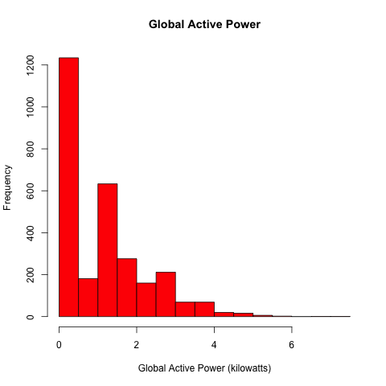
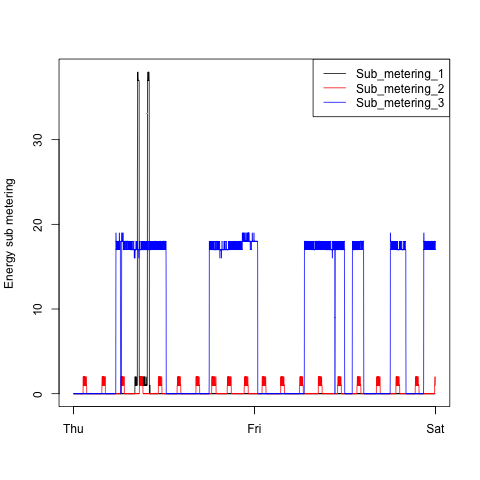
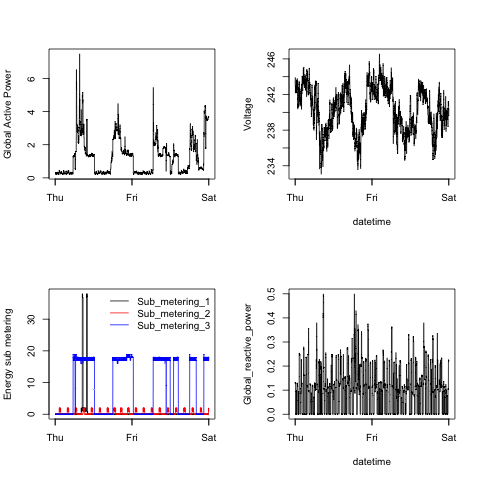

## Introduction

This assignment uses data from
the <a href="http://archive.ics.uci.edu/ml/">UC Irvine Machine
Learning Repository</a>, a popular repository for machine learning
datasets. In particular, this uses the "Individual household
electric power consumption Data Set" which is available on
the course web site:

* <b>Dataset</b>: <a href="https://d396qusza40orc.cloudfront.net/exdata%2Fdata%2Fhousehold_power_consumption.zip">Electric power consumption</a> [20Mb]

* <b>Description</b>: Measurements of electric power consumption in
one household with a one-minute sampling rate over a period of almost
4 years. Different electrical quantities and some sub-metering values
are available.

The following descriptions of the 9 variables in the dataset are taken
from
the <a href="https://archive.ics.uci.edu/ml/datasets/Individual+household+electric+power+consumption">UCI
web site</a>:

<ol>
<li><b>Date</b>: Date in format dd/mm/yyyy </li>
<li><b>Time</b>: time in format hh:mm:ss </li>
<li><b>Global_active_power</b>: household global minute-averaged active power (in kilowatt) </li>
<li><b>Global_reactive_power</b>: household global minute-averaged reactive power (in kilowatt) </li>
<li><b>Voltage</b>: minute-averaged voltage (in volt) </li>
<li><b>Global_intensity</b>: household global minute-averaged current intensity (in ampere) </li>
<li><b>Sub_metering_1</b>: energy sub-metering No. 1 (in watt-hour of active energy). It corresponds to the kitchen, containing mainly a dishwasher, an oven and a microwave (hot plates are not electric but gas powered). </li>
<li><b>Sub_metering_2</b>: energy sub-metering No. 2 (in watt-hour of active energy). It corresponds to the laundry room, containing a washing-machine, a tumble-drier, a refrigerator and a light. </li>
<li><b>Sub_metering_3</b>: energy sub-metering No. 3 (in watt-hour of active energy). It corresponds to an electric water-heater and an air-conditioner.</li>
</ol>

## Loading the data

1. I used a package sqldf to filter the data upon read. The dataset has 2,075,259 rows and 9 columns. The project is only using data from the dates 2007-02-01 and 2007-02-02. 

2. Date and time variables were converted to R date time formats.

## Making Plots

Our overall goal here is simply to examine how household energy usage
varies over a 2-day period in February, 2007. I have 
reconstructed the following plots using the base plotting system

Note that this repository was originally forked from [https://github.com/rdpeng/ExData_Plotting1](https://github.com/rdpeng/ExData_Plotting1)

* Plots are PNG file with a width of 480
pixels and a height of 480 pixels.

* Name of each plot files are  `Plot1.png`, `Plot2.png`, etc.

* Source code are found under src folder (`Plot1.R`, `Plot2.R`, etc.) that
constructs the corresponding plot, i.e. code in `Plot1.R` constructs
the `Plot1.png` plot. The R code file **includes code for reading
the data** so that the plot can be fully reproduced. 

The four plots constructed are shown below. 

### Plot 1

 

### Plot 2

 

### Plot 3

 

### Plot 4

 

